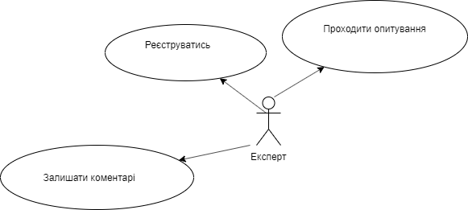
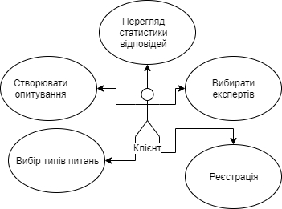

# Запити зацікавлених осіб
## Вступ
У цьому документі описуються запити зацікавлених осіб по відношенню до розроблювальної системи "Електронна деталізована мапа КПІ" в якості яких виступають: замовник - будь-яка фізична або юридична особа, що зацікавлені у розробці даної карти, і користувачі системи.
## 1.Мета
Метою документа є визначення основних вимог до функціональності, продуктивності, експлуатаційної придатності, а також визначення бізнес-правил і технологічних обмежень, пред'явлених предмету розробки.
## 2.Короткий огляд продукту
Система "Управління експертними питаннями" -це база данних питань і експертів ,а також адміністраторів системи. Система має два типи доступу:
1. Клієнти можуть створювати та розташовувати питання на вибрану тему. Для створювання питань потрібна реєстрація в системі і внесення всієї необхідної інормації.Після створення питань Клієнт отримує посилання яке може відправити експертам. При виникненні певних проблем Клієнт може звернутися до адміністрації для подальшого вирішення виниклої проблеми.
2. Експерти після отримання посилання можуть відповідати на питання. Реєстрація необов'язкова. Всі відповіді на питання автоматично додаються до бази данних та доступні для Клієнта.

## 3.Ділові правила та приписи
1. Призначення системи:
Система призначена для зручного зв'язку Клієнта і експертів які будуть проходити опитування.Система здатна позбавити Клієнта і експерта від прямого контакту і націлена на забезпечення нормальної роботи на великій відстані.
2. Політика взаємодії з експертами: 
Клієнтами системы можуть бути будь-які люди , зареєстровані в данній системі. Політика взаємодії в системі заключається в предоставленні 
різного роду інформации: 

- експертам – список питань,типи відповідей,перечень можливих відповідей.
- Клієнтам - кількість проходжень опитування, email зареєстрованих експертів, графіки відповідей на питання.

## 4.Сценарії
### 4.1	Додавання опитування
 Учасники:
•	Клієнт
•	Експерт
Передумови:
•	Клієнт має на своєму пристрої сервіс
•	Клієнт ідентифікований за допомогою облікового запису Google або email

 
Результат:
 

•	Нове опитування
 

Основний сценарій:
1.	Клієнт затискає +, вибирає пункт меню "Створити опитування", заповнює форму,створює питання та вибирає тип питання(закрите,напівзакрите,відкрите). Програма відсилає данні на сервер для обробки
2.	Клієнту виводиться повідомлення, про успішне створення опитування та посилання для проходження опитування
3.    Клієнт надсилає посилання експертам

### 4.2Проходження опитування
Учасники:
•	Експерти
Передумови:
•	Експерт має на своєму пристрої сервіс
•	Експерту надіслали посилання для проходження опитування
Результат:
 

•	Проходження опитування

Основний сценарій:
1. Експерт переходить за посиланням Клієнта
2. Експерт відповідає на питання в опитуванні та натискає на кнопку ,,відправити,,
3. Клієнт отримує відповіді експертів в графіку або діаграмі

## 5.Функціональність

Основні	вимоги	до	функціональності,	пред'явлені	зацікавленими	особами, відносяться до трьох категорій:
1.	Клієнт
2.	Експерт

### 5.1    Можливості експерта
•	Перегляд доступних питань
•	Відповідати на питання
•	Реєстрація
•	Залишати коментарі під питаннями
•	Мати можливість не обов'язково відповідати на всі питання
### 5.2	Можливості Клієнта
•	Реєстрація
•	Створення опитувань
•     Вибір типів питань
•     Вибір експертів
•     Отримування відповідей в особистому кабінеті або на почті
## 6.	Практичність
### 6.1.	Масштабованість інтерфейсу
Інтерфейс має змінювати свої розміри, відносно до роздільної здатності екрану пристрою

### 6.2	Інтерфейс користувача
Інтерфейс користувача має відповідати наступним вимогам:
1.	Бути зрозумілим і не мати надлишкових функцій
2.	Бути виконаним з урахуванням енергомічних вимог
3.	Мати вхідний гайд по основним функціям, для швидкого ознайомлення користувача з додатком

## 7.	Надійність
Протягом усього терміну підтримки додатку, повинна бути забезпечена цілісність, незмінність ззовні і достовірність внесених даних
Для забезпечення збереження та цілісності використовуватиметься метод резервного копіювання.
Для збереження незмінності та достовірності використовуватиметься комплекс технологічних і адміністративних процедур, що перешкоджають випадковій або навмисній зміні даних ззовні.

.PNG)

.PNG)
.PNG)

